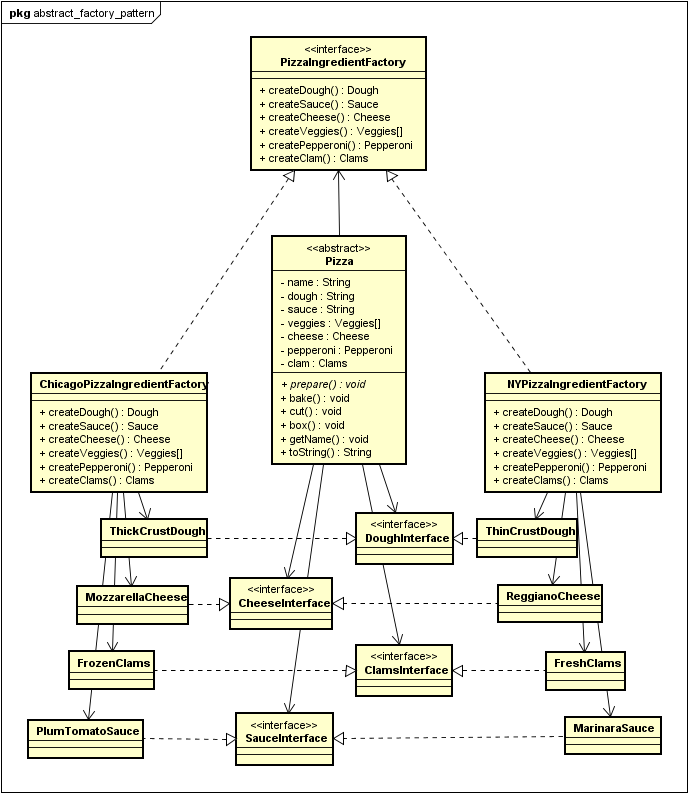

[[zurück](../README.md)]

# sew4-design-patterns-faydin-tgm
sew4-design-patterns-faydin-tgm created by GitHub Classroom


## **Abstract Factory Pattern**
Der Abstract Factory Pattern wird in diesem Dokument behandelt.

#### Erklärung:
Der Abstract Factory Pattern baut auf den Factory Pattern auf. Mit dem Abstract Factory Pattern kann man mittels eines Interfaces, verwandte und miteinander abhängige Klassen erstellen, ohne konkrete Klassen zu spezifizieren. Mit anderen Worten kann man also sagen, dass der Abstract Factory Pattern den Strategy Pattern verwendet, um dies zu ermöglichen. Das bedeutet beispielsweise, dass man statt mehreren konkreten Klassen für verschiedene Arten von der selben Sache, nur eine konkrete Klasse verwendet und ein Kompontent, mit dem "entschieden" wird, welche Art dieser Sache verwendet wird. Dadurch ermöglicht der Abstract Factory Pattern sehr viel Flexibilität und baut stark auf abstrakte Klassen und Interfaces auf.

#### UML


#### Code Beispiel
Ich habe das Beispiel aus dem Buch Head First Design Patterns genommen, um den Abstract Factory Pattern zu erklären. 
Das Beispiel ist für die Erklärung gekürzt worden. Alle Klassen sind als Java Dateien erhältlich.

Man braucht zuerst den Interface:
```java
public interface PizzaIngredientFactory {
	public Dough createDough();
	public Sauce createSauce();
	public Cheese createCheese();
	public Veggies[] createVeggies();
	public Pepperoni createPepperoni();
	public Clams createClam();
}
```

Um jetzt statt den konkreten Klassen NYStyleCheesePizza und ChicagoStyleCheesePizza nur eine CheesePizza Klasse haben zu können, müssen dafür konkrete IngredientFactories erstellt werden:
```java
public class ChicagoPizzaIngredientFactory implements PizzaIngredientFactory {

	//Hier werden die einzelnen Zubereitungsarten hinzugefügt. 
	//Wie es zubereitet wird, hängt von der Factory ab.
	
	public Dough createDough() {		
		return new ThickCrustDough();			
	}
	
	public Sauce createSauce() {
		return new PlumTomatoSauce();
	}
	
	public Cheese createCheese() {
		return new MozzarellaCheese();
	}
	
	public Veggies[] createVeggies() {
		Veggies veggies[] = { new BlackOlives(), new Spinach(), new Eggplant() };
		return veggies;
	}
	
	public Pepperoni createPepperoni() {
		return new SlicedPepperoni();
	}
	
	public Clams createClam() {
		return new FrozenClams();
	}
}
```

Pizza Klasse:
```java
public abstract class Pizza {
String name;

	Dough dough;
	Sauce sauce;
	Veggies veggies[];
	Cheese cheese;
	Pepperoni pepperoni;
	Clams clam;
	
	abstract void prepare();	
		//prepare() ist nun abstrakt, damit man in der Unterklasse bestimmen kann, 
		//welche Zutatenart verwendet werden soll.
	
	void bake() {
		System.out.println("Bake for 25 minutes at 350");
	}

	void cut() {
		System.out.println("Cutting the pizza into diagonal slices");
	}
  
	void box() {
		System.out.println("Place pizza in official PizzaStore box");
	}
 
	public String getName() {
		return name;
	}

	public String toString() {
		StringBuffer display = new StringBuffer();
		display.append("---- " + name + " ----\n");
		display.append(dough + "\n");
		display.append(sauce + "\n");
		for (int i = 0; i < toppings.size(); i++) {
			display.append((String )toppings.get(i) + "\n");
		}
		return display.toString();
	}
}
```

Nun zur konkreten Pizza Klasse:
Hier kann man den Strategy Pattern erkennen.
```java
public class CheesePizza extends Pizza {
	PizzaIngredientFactory ingredientFactory;

	public CheesePizza(PizzaIngredientFactory ingredientFactory) {  //Man bekommt eine konkrete PizzaIngredientFactory.
		this.ingredientFactory = ingredientFactory;
	}
	
	void prepare() {		
		//Bei prepare(), welches überschrieben wird, da es bei Pizza abstrakt ist, 
 		//kann man nun sehen, dass man mit der Factory die Zubereitungsarten bekommt.
			
			//Die Klasse CheesePizza weiß nicht, um welche Factory es sich handelt, 
			//hauptsache, man kann sie verwenden. Das bedeutet auch, 
			//dass CheesePizza eine lose verbindung zu den Factories hat. 
			//Man kann also neue Factories problemlos hinzufügen und die selben konkreten Pizza Klassen verwenden.
		System.out.println("Preparing " + name);
		dough = ingredientFactory.createDough();
		sauce = ingredientFactory.createSauce();
		cheese = ingredientFactory.createCheese();
	}
}
```

Noch ein letzter Schritt:
Die konkrete PizzaStore Klasse muss etwas geändert werden, damit das ganze funktioniert:
```java
public class ChicagoStylePizzaStore extends PizzaStore {

	protected Pizza createPizza(String item) {
		Pizza pizza = null;
		PizzaIngredientFactory ingredientFactory = new ChicagoPizzaIngredientFactory();	//Hier wird die konkrete Factory instantiert.
		
		if (item.equals("cheese")) {
			pizza = new CheesePizza(ingredientFactory);	
				//Damit die konkreten Pizzaklassen überhaupt die 
				//konkreten Factories bekommen, müssen sie hier übergeben werden.
			
			pizza.setName("Chicago Style Cheese Pizza");
		} else if (item.equals("veggie")) {
			pizza = new VeggiePizza(ingredientFactory);
			pizza.setName("Chicago Style Veggie Pizza");
		{ else if (item.equals("clam")) {
			pizza = new ClamPizza(ingredientFactory);
			pizza.setName("Chicago Style Clam Pizza");
	 	} else if (item.equals("pepperoni")) {
	 		pizza = new PepperoniPizza(ingredientFactory);
	 		pizza.setName("Chicago Style Pepperoni Pizza");
	 	}
	 	
	 	return pizza;		
	}
}
```

Testklasse:
Bei der Testklasse muss nichts geändert werden.
```java
public class Testklasse {
 
	public static void main(String[] args) {
		PizzaStore nyStore = new NYPizzaStore();
		PizzaStore chicagoStore = new ChicagoPizzaStore();
 
		Pizza pizza = nyStore.orderPizza("cheese");
		System.out.println("You ordered a " + pizza.getName() + "\n");

		pizza = chicagoStore.orderPizza("cheese");
		System.out.println("You ordered a " + pizza.getName() + "\n");
	}
}
```

### Quellen
* "Head First Design Patterns" von Eric Freeman, Elisabeth Robson, Bert Bates und Kathy Sierra
