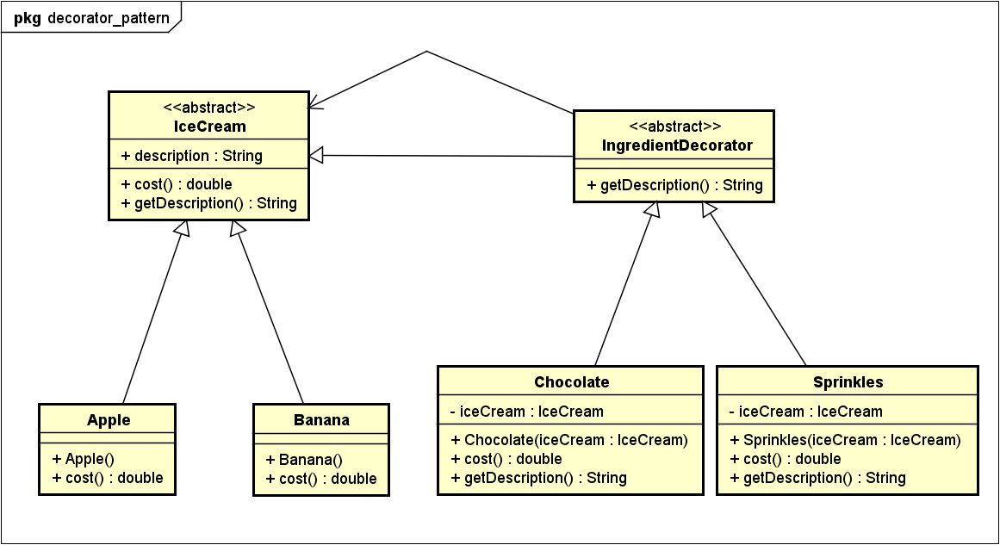

[[zurück](../README.md)]

# sew4-design-patterns-faydin-tgm
sew4-design-patterns-faydin-tgm created by GitHub Classroom


## **Decorator Pattern**
Der Decorator Pattern wird in diesem Dokument behandelt.

#### Erklärung:
Mit dem Decorator Pattern kann man eine bestimmte Klasse mit Objekten des selben Datentyps "dekorieren". Das bedeutet, dass man dieser Klasse bestimmte Eigenschaften hinzufügen kann, mittels der Polymorphie. Die Dekorierung kann zur Laufzeit erfolgen und man kann eine Klasse auch mit mehreren Objekten dekorieren. 
Es funktioniert nach dem Offen/Geschlossen Prinzip: Klassen sollten nicht modifizierbar, sondern erweiterbar sein.

#### Problembeschreibung
Zu viele Subklassen: Wenn ein Objekt verschiedene Eigenschaften haben kann und diese sich auch verschachteln können, kommt es bei einer normalen Implementierung oft dazu, dass diese Klasse zu viele Subklassen hat, sodass es sehr verwirrend und schwer bei der Wartung ist, bzw. schlecht Änderbar ist. 

#### Lösung
Eine Alternative zu Subklassen: Der Decorator Pattern! Damit definiert der Programmierer Klassen, die als Decorator verwendet werden und Klassen, die dekoriert werden können.

#### UML


#### Code Beispiel
Das Beispiel ist für die Erklärung gekürzt worden. Alle Klassen sind als Java Dateien erhältlich.

Es geht in dem Beispiel um einen Eisladen, das viele neue Zutaten in ihr Sortiment hinzugefügt hat. Man soll nun das bestehende System erweitern, sodass es nicht zu Wartungsproblemen kommt.

Zuerst definieren wir eine abstrakte Klasse "IceCream":
```java
public abstract class IceCream(){
	public String description = "IceCream not defined";
	public abstract double cost();
	public String getDescription(){
		return description;
	}
}
```

Nun die konkreten Komponenten, in diesem Beispiel werde ich nur die Apfel und die Bananen Sorte als Beispiel nehmen.
```java
public class Apple extends IceCream {
	public Apple(){
		description = "Apple";
	}
	public double cost(){
		return 1.05;
	}
}
```
```java
public class Banana extends IceCream {
	public Banana(){
		description = "Banana";
	}
	public double cost(){
		return 0.99;
	}
}
```

Nun können wir den Decorator und die konkreten Decorator definieren. Auch der Decorator ist abstrakt.
Decorator:
```java
public abstract class IngredientDecorator extends IceCream {
	public abstract String getDescription();
}
```
Konkrete Decorator:
```java
public class Chocolate extends IngredientDecorator {
	IceCream iceCream;
	public Chocolate(IceCream iceCream){
		this.iceCream = iceCream;
	}
	public double cost(){
		return 0.20 + iceCream.cost();
	}
	public String getDescription(){
		return iceCream.getDescription() + ", Chocolate";
	}
}
```

Testklasse, bestellen wir ein Eis mit Apfel Geschmack mit einer Schockoladenglasur und Zuckerstreusel:
```java
public class Testklasse {
	public static void main(String[] args){
		IceCream testIceCream = new Apple();
		testIceCream = new Chocolate(testIceCream);
		testIceCream = new Sprinkles(testIceCream);
		System.out.println("Your order: " + testIceCream);
	}
}
```

Ausgabe: 
> Your order: Apple Ice Cream, Chocolate, Sprinkles €1.30

### Quellen
* "Head First Design Patterns" von Eric Freeman, Elisabeth Robson, Bert Bates und Kathy Sierra
