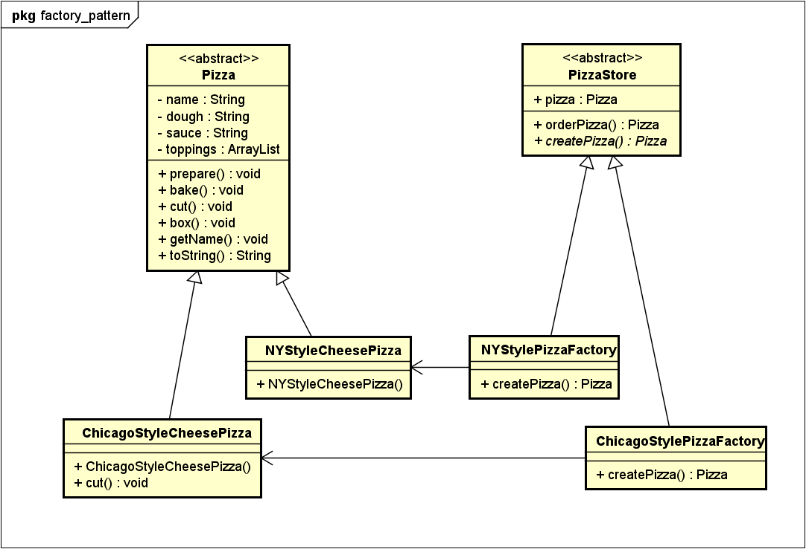

[[zurück](../README.md)]

# sew4-design-patterns-faydin-tgm
sew4-design-patterns-faydin-tgm created by GitHub Classroom


## **Factory Pattern**
Der Factory Pattern wird in diesem Dokument behandelt.

#### Erklärung:
Mit dem Factory Pattern kann man Klassen erstellen, ohne zu spezifizieren, wekche konkrete Klassen man instantiert. Außerdem kann man vermeiden, das eine Klasse zu abhängig von konkreten Subklassen ist und somit der Code der Superklasse, bei Änderung einer Subklasse, verändert werden muss. 
Benutzt wird es, wenn eine Methode eines von mehreren möglichen Klassen zurückgibt, die die selbe Superklasse haben, wenn man nicht weiß, welches Klassenobjekt man brauchen wird und wenn man nicht will, dass der Client/User jede Unterklasse kennt, sondern nur die, die auch gebraucht werden.
Die Objekt Erstellung wird beim Factory Pattern verkapselt, bzw. vom unveränderbaren Code getrennt und nur an einer bestimmten Klasse gemacht.

#### Problembeschreibung
Klassen, die von vielen konkreten Unterklassen abhängig sind, können beim Hinzufügen von weiteren konkreten Unterklassen Probleme verursachen.

Wenn man eine Klasse hat, die Objekte zur Laufzeit dynamisch bereitstellen soll, ist es schlecht, wenn man konkrete Klassen (und den "new" Operator) benutzt. Wenn man dies nähmlich so macht, ist es so, dass die Superklasse von sehr vielen Unterklassen abhängig ist. Somit müsste man die Superklasse ändern, wenn man neue Unterklassen zur Auswahl hinzufügt oder bestehende Unterklassen ändert. Es gilt das Prinzip: "Klassen sollten nicht modifizierbar, sondern erweiterbar sein". Man sollte also nicht den Code in der Superklasse ändern müssen, sondern diese nur erweitern. Daher will man nicht, dass die Superklasse jede Unterklasse kennt.

#### Lösung
Mit dem Factory Pattern kann man dieses Problem lösen. Der Factory Pattern baut auf das The Dependency Inversion / Abhängigkeit Umkehrung Prinzip auf, welches besagt: "Depend upon abstractions. Do not depend upon concrete classes.". 
Man sollte also abhängig von abstrakten Klassen sein, statt von konkreten Klassen. Indem an abstrakte Klassen verwendet, kann man die Unterklassen entscheiden lassen, welche Klassen instantiert werden.

#### UML


#### Code Beispiel
Ich habe das Beispiel aus dem Buch Head First Design Patterns genommen, um den Factory Pattern zu erklären.
Das Beispiel ist für die Erklärung gekürzt worden. Alle Klassen sind als Java Dateien erhältlich.

Klasse PizzaStore:
```java
public abstract class PizzaStore {
	public Pizza orderPizza(String type) {
		Pizza pizza;
	
	   pizza = createPizza(type); //Wie Hier zu sehen ist, wird die Pizza nicht in PizzaStore erstellt, somit ist PizzaStore nicht von den Unterklassen abhängig. 
	
		pizza.prepare();  //Dies ist der Teil, der sich nicht verändert.
		pizza.bake();
		pizza.cut();
		pizza.box();
		return pizza;
	}
	abstract Pizza createPizza(String type); //Stattdessen wird eine abstrakte Methode aufgerufen. 
}
```

Hier sind die Factories, die von PizzaStore erben:
```java
public class NYStylePizzaStore extends PizzaStore {
	//orderPizza() wird schon von PizzaStore geerbt, da es nicht abstract ist.
	
	public Pizza createPizza(String type) {		//die createPizza() muss allerdings überschrieben werden, da es abstract ist.
		if (type.equals("cheese") {	// Hier lässt man die Unterklasse entscheiden, was für eine konkrete Pizza erstellt wird.
			pizza = NYStyleCheesePizza();
		} else if (type.equals("pepperoni"){
			pizza = NYStylePepperoniPizza(); 
		} else if (type.equals("clam"){
			pizza = NYStyleClamPizza(); 
		} else if (type.equals("veggie"){
			pizza = NYStyleVeggiePizza(); 						
	}
}

public class ChicagoStylePizzaStore extends PizzaStore {	//Das selbe auch hier
	public Pizza createPizza(String type) {
		if (type.equals("cheese") {
			pizza = ChicagoStyleCheesePizza();
		} else if (type.equals("pepperoni"){
			pizza = ChicagoStylePepperoniPizza(); 
		} else if (type.equals("clam"){
			pizza = ChicagoStyleClamPizza(); 
		} else if (type.equals("veggie"){
			pizza = ChicagoStyleVeggiePizza(); 						
	}
}
```

Dies sind die konkreten Pizza Klassen, die von der abstrakten Klasse Pizza erben:
```java
public class NYStyleCheesePizza extends Pizza {

	public NYStyleCheesePizza() { 
		name = "NY Style Sauce and Cheese Pizza";
		dough = "Thin Crust Dough";
		sauce = "Marinara Sauce";
 
		toppings.add("Grated Reggiano Cheese");
	}
}

public class ChicagoStyleCheesePizza extends Pizza {

	public ChicagoStyleCheesePizza() { 
		name = "Chicago Style Deep Dish Cheese Pizza";
		dough = "Extra Thick Crust Dough";
		sauce = "Plum Tomato Sauce";
 
		toppings.add("Shredded Mozzarella Cheese");
	}
 
	void cut() {
		System.out.println("Cutting the pizza into square slices");
	}
}
```

Abstrakte Klasse Pizza:
```java
public abstract class Pizza {
	String name;
	String dough;
	String sauce;
	ArrayList toppings = new ArrayList();
 
	void prepare() {
		System.out.println("Preparing " + name);
		System.out.println("Tossing dough...");
		System.out.println("Adding sauce...");
		System.out.println("Adding toppings: ");
		for (int i = 0; i < toppings.size(); i++) {
			System.out.println("   " + toppings.get(i));
		}
	}
	
	void bake() {
		System.out.println("Bake for 25 minutes at 350");
	}
	
	void cut() {
		System.out.println("Cutting the pizza into diagonal slices");
	}
  
	void box() {
		System.out.println("Place pizza in official PizzaStore box");
	}
 
	public String getName() {
		return name;
	}

	public String toString() {
		StringBuffer display = new StringBuffer();
		display.append("---- " + name + " ----\n");
		display.append(dough + "\n");
		display.append(sauce + "\n");
		for (int i = 0; i < toppings.size(); i++) {
			display.append((String )toppings.get(i) + "\n");
		}
		return display.toString();
	}
}
```

Testklasse:
```java
public class Testklasse {
 
	public static void main(String[] args) {
		PizzaStore nyStore = new NYPizzaStore();
		PizzaStore chicagoStore = new ChicagoPizzaStore();
 
		Pizza pizza = nyStore.orderPizza("cheese");
		System.out.println("You ordered a " + pizza.getName() + "\n");
 
		pizza = chicagoStore.orderPizza("cheese");
		System.out.println("You ordered a " + pizza.getName() + "\n");
	}
}
```

### Quellen
* "Head First Design Patterns" von Eric Freeman, Elisabeth Robson, Bert Bates und Kathy Sierra
