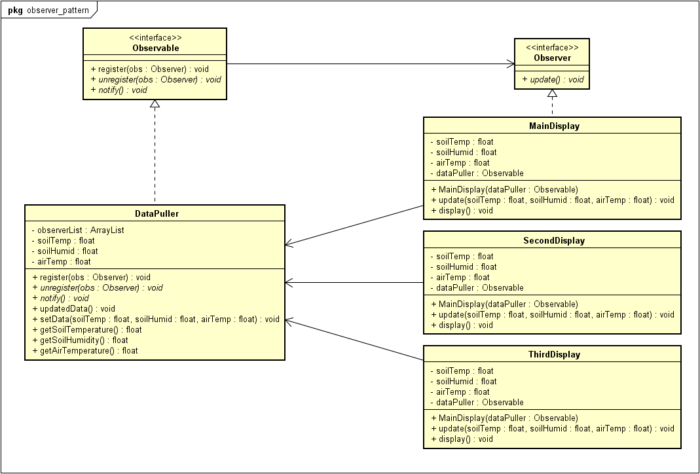

[[zurück](../README.md)]

# sew4-design-patterns-faydin-tgm
sew4-design-patterns-faydin-tgm created by GitHub Classroom


## **Observer Pattern**
Der Observer Pattern wird in diesem Dokument behandelt.

#### Erklärung:
Mit dem Observer Pattern können Klassen, die Observer sind, auf Änderungen des Subjekts reagieren, bzw. neue Daten vom Observer erhalten.
Es wird eine 1 zu N Beziehung zwischen Objekten definiert. Alle Objekte, die als "Observer" registriert sind, werden benachrichtigt, wenn sich der Zustand des "Subjekts" ändert.

#### Problembeschreibung
Nehmen wir an, man programmiert eine Anwendung, die Werte aus bestimmten Sensoren ausliest und diese in einer GUI ausgibt. Ein Feature dieses Programmes soll der sein, dass der Endbenutzer ganz einfach mehr Displays, bzw. Bereiche, in seine GUI hinzufügen können soll und auch in diesen Displays die Werte der Sensoren ausgegeben werden. Man hat beim bereits implementierten Code nun das Problem, dass man ohne Änderung des Codes keine neuen Displays hinzufügen kann. 

#### Lösung
Es wurde von den Entwicklern beschlossen, dass sie ein Observer Pattern für die Lösung dieses Problems nutzen.
Es besteht dadurch eine lockere Kommunikation. Das bedeutet, dass die Observer nur die Schnittstelle vom Subjekt kennen, und andersrum. Dadurch können einfach neue Sensoren als Observable registriert werden.

#### UML


#### Code Beispiel
Das Beispiel ist für die Erklärung gekürzt worden. Alle Klassen sind als Java Dateien erhältlich.

Zuerst sollte man den Subject, bzw. Observable, und den Observer Interface definieren:
```Java
public interface Observable {
	public void register(Observer obs);
	public void unregister(Observer obs);
	public void notify();
}
```
```Java
public interface Observer {
	public void update();
}
```

Danach sollte man die konkreten Subjects und Observer definieren.
Subjekt/Observable:
```Java
public class DataPuller implements Observable {
	private ArrayList observerList;
	private float soilTemp;
	private float soilHumid;
	private float airTemp;
	
	public DataPuller(){
		observerList = new ArrayList();
	}
	public void register(Observer obs) {
		observerList.add(obs);
	}
	public void unregister(Observer obs){
		int indexNr = observerList.indexOf(obs);
		if(!indexNr < 0){
			observerList.remove(indexNr);
		}
	}
	public void notify(){
		for(int i = 0; i < observers.size(); i++){
			observerList.get(i).update(soilTemp, soilHumid, airTemp);
		}
	}
	public void updatedData(){
		notify();
	}
	public void setData(float soilTemp, float soilHumid, float airTemp){
		this.soilTemp = soilTemp;
		this.soilHumid = soilHumid;
		this.airTemp = airTemp;
	}
	public float getSoilTemperature(){
		return soilTemp;
	}
	public float getSoilHumidity(){
		return soilHumid:
	}
	public float getAirTemperature(){
		return airTemp;
	}
}
```

Ich werde in diesem Beispiel nur den Code von einem der 2 Observer zeigen, um es kurz zu halten.
Observer:
```Java
public class MainDisplay implements Observer {
	private float soilTemp;
	private float soilHumid;
	private float airTemp;
	private Observable dataPuller;
	
	public MainDisplay(Observable dataPuller){
		this.dataPuller = dataPuller;
		dataPuller.register(this);
	}
	public void update(float soilTemp, float soilHumid, float airTemp){
		this.soilTemp = soilTemp;
		this.soilHumid = soilHumid;
		this.airTemp = airTemp;
		display();
	}
	public void display(){
		System.out.println("Soil Temperature: " + soilTemp + "°C\nSoil Humidity: " + soilHumid + "%\nAir Temperature: " + airTemp + "°C\n");
	}
}
```


### Quellen
* "Head First Design Patterns" von Eric Freeman, Elisabeth Robson, Bert Bates und Kathy Sierra
