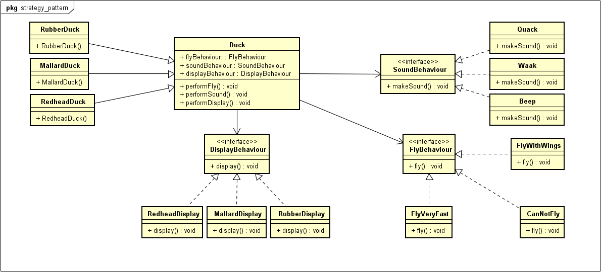

[[zurück](../README.md)]

# sew4-design-patterns-faydin-tgm
sew4-design-patterns-faydin-tgm created by GitHub Classroom


## **Strategy Pattern**
Der Strategy Pattern wird in diesem Dokument behandelt.

#### Erklärung:
Mit dem Strategy Pattern kann man eine Gruppe von Algorithemn bzw. Klassen erstellen, die man zur Laufzeit austauschen bzw. hinzufügen kann.

#### Problembeschreibung
Codeverdopplung: Manche Subklassen sollen bestimmte Methoden haben, andere Subklassen der selben Superklasse sollen diese Methoden nicht haben. Wenn man es mit einem Interface bzw. einer Implementierung löst, müsste man bei einer Änderung der Methode, diese in jeder Unterklasse ändern.

#### Lösung
Zur Lösung dieses Programmierproblems kann man den Strategy Pattern verwenden. Dadurch kann man zur Laufzeit festlegen, welche Subklassen welche Eigenschaften haben sollen, ohne in jeder einzelnen Klasse diese Methode zu schreiben.

#### UML



#### Code Beispiel
Um den Strategy Pattern zu erkären, erweitere ich das Beispiel aus dem Buch "Head First Design Patterns".
Das Beispiel ist für die Erklärung gekürzt worden. Alle Klassen sind als Java Dateien erhältlich.

Man hat eine Enten-Klasse, das mehrere Subklassen bzw. mehrere Entenarten hat. Manche dieser Entenarten können fliegen und quaken, manche nicht. Genauso gibt es auch Entenarten, die quaken, aber nicht fliegen können, und auch andersrum. Außerdem gibt es auch verschiedene Quak-/Flugarten. Außerdem werde ich auch den Displayverhalten hinzufügen, welches beim Buch nicht enthalten war.

Um dies nach dem Strategy Pattern umzusetzen, muss man zuerst einmal ein Interface für die verschiedenen Verhaltensarten hinzufügen:
```java
public interface FlyBehaviour {
	public void fly();
}
```
```java
public interface SoundBehaviour {
	public void makeSound();
}
```
```java
public interface DisplayBehaviour {
	public void display();
}
```

Nun sollte man die einzelnen Verhaltensarten hinzufügen, bzw. die jeweiligen Interfaces implementieren:
Flying Behaviors:
```java
public class FlyWithWings implements FlyBehaviour {
	public void fly () {
		//Add flying behaviour here!
	}
}
```
```java
public class CanNotFly implements FlyBehaviour {
	public void fly () {
		//Add flying behaviour here!
	}
}
```
```java
public class FlyVeryQuickly implements FlyBehaviour {
	public void fly () {
		//Add flying behaviour here!
	}
}
```
Sound behaviours:
```java
public class QuackSound implements SoundBehaviour {
	public void makeSound () {
		//Add sound behaviour here!
	}
}
```
```java
public class WaakSound implements SoundBehaviour {
	public void makeSound () {
		//Add sound behaviour here!
	}
}
```
```java
public class BeepSound implements SoundBehaviour {
	public void makeSound () {
		//Add sound behaviour here!
	}
}
```
Display behaviours:
```java
public class MallardDisplay implements DisplayBehaviour {
	public void display () {
		//Add display behaviour here!
	}
}
```
```java
public class RubberDisplay implements DisplayBehaviour {
	public void display () {
		//Add display behaviour here!
	}
}
```
```java
public class RedheadDisplay implements DisplayBehaviour {
	public void display () {
		//Add display behaviour here!
	}
}
```

Nun kommen wir zu Klasse Duck, hier sollte man die Interfaces als Attribute haben:
```java
public class Duck {
	public FlyBehaviour flyBehaviour;
	public SoundBehaviour soundBehaviour;
	public DisplayBehaviour displayBehaviour;
	
	public void performFly () {
		flyBehaviour.fly();
	}
	public void performSound () {
		soundBehaviour.makeSound();
	}
	public void performDisplay () {
		displayBehaviour.display();
	}
}
```

Um bei den Unterklassen die richtigen Verhalten zu haben, werden diese im Konstruktor festgelegt, dabei ist zu beachten, dass die Attribute von Duck geerbt werden:
```java
public class RedheadDuck extends Duck {
	public RedheadDuck() {
		flyBehaviour = new FlyVeryQuickly();
		soundBehaviour = new WaakSound();
		displayBehaviour = new RedheadDuckDisplay();
	}
}
```

Test:
```java
public class Testklasse {
	public static void main(String[] args) {
		Duck redhead = new RedheadDuck();
		redhead.performDisplay();
		redhead.performSound();
		redhead.performFly();
	}
}
```
Die Ausgabe:
> I am a Redhead Duck: I have a red head!

> Waak! Wak wak

> The duck prepared itself for flying. The very next second, the duck was too far away to be seen by the naked eye.

### Quellen
* "Head First Design Patterns" von Eric Freeman, Elisabeth Robson, Bert Bates und Kathy Sierra
